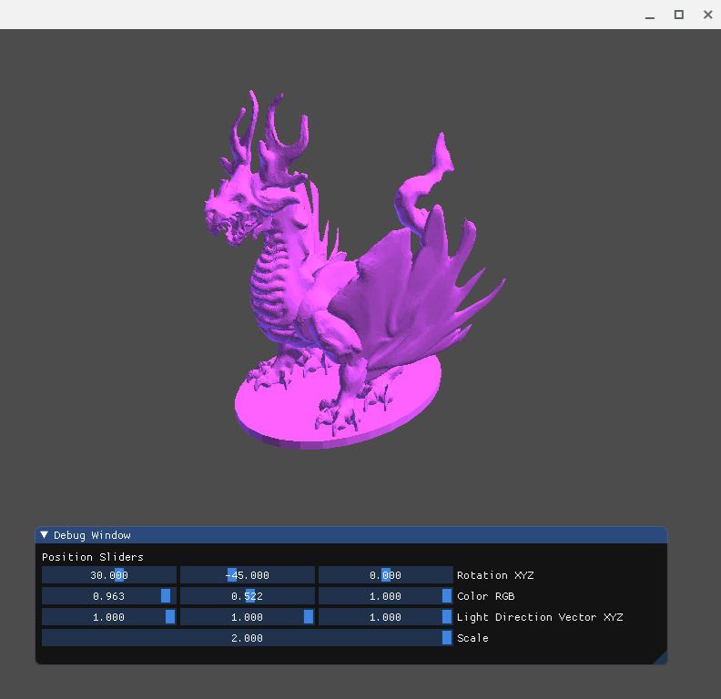
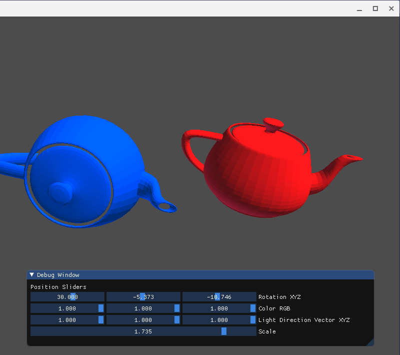

# POGLR ( The Portable OpenGL Renderer )
A simple and abstracted OpenGL 3D Renderer to test objects and help teach newcomers the basics of OpenGL.

File loading

Object instancing

# Features:
- OBJ file loading
- Hard edge flat shading
- ImGUI interface
- RGB Color, Scale, Rotation, and Light Vector controls
- Batched rendering system

# Getting Started:
Create a Renderer subclass and override the onCreate and onUpdate functions. See main.cpp file for examples

# Build (Linux):
Install dependencies:
- glfw
- glew
- opengl

Run make. Output should be in the /bin folder
